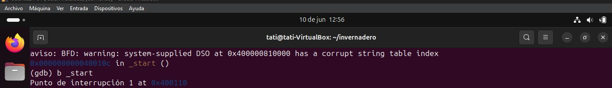
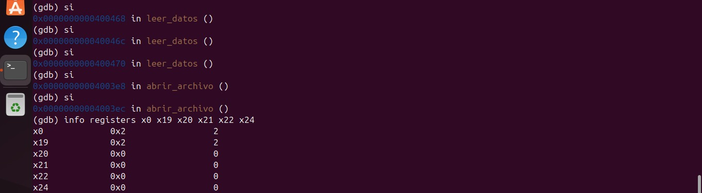
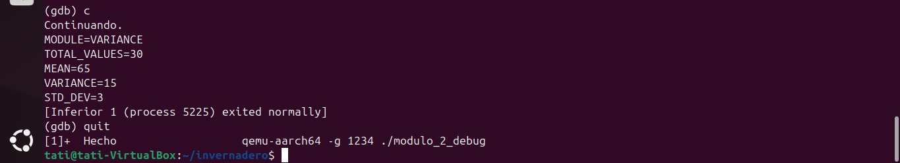

# Módulo 2 - Varianza y Desviación Estándar

## Información General

- **Proyecto:** Invernadero Inteligente IoT
- **Curso:** Arquitectura y Organización de Computadoras y Ensambladores 1
- **Archivo fuente:** modulo_2_varianza.s
- **Responsable:** Jackeline Stephany Rivera
- **Variable analizada:** Humedad del Aire (HUM_AIRE)
- **Cantidad de datos procesados:** 30 registros

---

# 1. Descripción del módulo

Este módulo implementa una rutina en lenguaje ensamblador ARM64 encargada de calcular la media, la varianza y la desviación estándar de las lecturas de humedad del aire almacenadas en el archivo `lecturas.csv`.

La varianza permite medir qué tan dispersos se encuentran los datos respecto a su media, mientras que la desviación estándar representa dicha dispersión en las mismas unidades de la variable analizada.

El resultado final se almacena en el archivo:

```text
resultado_varianza.txt
```

---

# 2. Objetivo

Analizar estadísticamente las lecturas de humedad del aire mediante el cálculo de:

- Media aritmética
- Varianza
- Desviación estándar
- Generación automática de un archivo de resultados

---

# 3. Algoritmo Implementado

El algoritmo sigue las siguientes etapas:

## Paso 1: Lectura de datos

Se utiliza la rutina:

```asm
leer_datos
```

proporcionada por `utils.s`.

Esta función:

- Abre el archivo `lecturas.csv`
- Extrae la columna HUM_AIRE
- Convierte los valores ASCII a enteros
- Almacena los 30 datos en el arreglo `datos`

---

## Paso 2: Cálculo de la media

Se recorren los 30 valores almacenados en memoria

Fórmula:

```text
MEDIA = ΣX / N
```

Donde:

- X = valor de humedad del aire
- N = 30

Proceso:

1. Recorrer los 30 datos
2. Acumular la suma total
3. Dividir entre 30
4. Guardar la media obtenida

---

## Paso 3: Cálculo de la varianza

Se calcula la dispersión de los datos respecto a la media.

Fórmula:

```text
VAR = Σ(X - MEDIA)² / N
```

Proceso:

1. Recorrer nuevamente los 30 datos
2. Calcular la diferencia respecto a la media
3. Obtener el valor absoluto de la diferencia
4. Elevar la diferencia al cuadrado
5. Acumular todos los cuadrados
6. Dividir entre 30

El resultado se almacena como la varianza del conjunto de datos.

---

## Paso 4: Cálculo de la desviación estándar

Una vez obtenida la varianza, se calcula:

```text
DESV = √VAR
```

Debido a que ARM64 no posee una instrucción directa para raíz cuadrada entera, se implementa una rutina propia utilizando el método iterativo de Newton-Raphson.

---

## Paso 5: Construcción del archivo de salida

Se crea un buffer de salida que contiene:

```text
MODULE=VARIANCE
TOTAL_VALUES=30
MEAN=...
VARIANCE=...
STD_DEV=...
```

Los valores numéricos son convertidos a texto mediante:

```asm
int_a_ascii
```

---

## Paso 6: Escritura del archivo

El programa:

1. Crea el archivo `resultado_varianza.txt`
2. Escribe el contenido generado
3. Cierra el archivo
4. Muestra el resultado también en pantalla para verificación

---

# 4. Flujo del Programa

```text
lecturas.csv
       │
       ▼
leer_datos()
       │
       ▼
calcular_media()
       │
       ▼
calcular_varianza()
       │
       ▼
raiz_cuadrada()
       │
       ▼
construir_buffer()
       │
       ▼
resultado_varianza.txt
```

---

# 5. Uso de Memoria

## Sección .data

Contiene cadenas utilizadas para generar el archivo de salida.

Variables principales:

```asm
nombre_salida
linea_module
linea_total
label_mean
label_var
label_desv
newline
```

Estas cadenas son copiadas al buffer de salida antes de escribir el archivo.

---

## Sección .bss

Memoria reservada para almacenamiento temporal.

| Variable | Tamaño | Descripción |
|-----------|---------|-------------|
| buffer_salida | 512 bytes | Construcción del archivo de salida |
| buf_media | 32 bytes | Conversión de la media a ASCII |
| buf_var | 32 bytes | Conversión de la varianza a ASCII |
| buf_desv | 32 bytes | Conversión de la desviación estándar a ASCII |

---

# 6. Registros Utilizados

## Registros principales

| Registro | Uso |
|-----------|-----|
| x0 | Parámetros y retornos |
| x1 | Direcciones de memoria |
| x2 | Flags y parámetros |
| x3 | Permisos de archivos |
| x8 | Número de syscall |
| x9 | Posición actual en buffer de salida |
| x10 | Descriptor del archivo |
| x19 | Dirección base del arreglo de datos |
| x20 | Acumulador de suma |
| x21 | Contador de iteraciones |
| x22 | Valor actual del arreglo |
| x23 | Valor constante N=30 |
| x24 | Media |
| x25 | Suma de cuadrados |
| x26 | Diferencia respecto a la media |
| x27 | Diferencia elevada al cuadrado |
| x28 | Varianza |
| x29 | Desviación estándar y Frame Pointer |
| x30 | Link Register |

---

# 7. Ciclos Utilizados

## Ciclo de suma de datos

Etiqueta:

```asm
.loop_suma
```

Recorre los 30 datos para obtener la suma total utilizada en la media.

---

## Ciclo de cálculo de varianza

Etiqueta:

```asm
.loop_varianza
```

Recorre nuevamente los datos para calcular:

```text
(dato - media)²
```

de cada elemento.

---

## Ciclo de Newton-Raphson

Etiqueta:

```asm
.loop_newton
```

Calcula iterativamente la raíz cuadrada de la varianza.

---

## Ciclos de construcción del buffer

Etiquetas:

```asm
.loop_cm
.loop_ct
.loop_clm
.loop_clv
.loop_cld
.loop_cc
```

Copian cadenas y resultados al buffer de salida.

---

# 8. Saltos Condicionales Utilizados

| Instrucción | Función |
|------------|----------|
| b | Salto incondicional |
| beq | Igual |
| bne | Diferente |
| bge | Mayor o igual |
| cbz | Comparar contra cero |

Los saltos permiten:

- Controlar ciclos
- Verificar finalización de recorridos
- Determinar diferencias respecto a la media
- Controlar la convergencia del método Newton-Raphson
- Finalizar procesos de copia y escritura

---

# 9. Subrutinas Implementadas

## leer_datos

Obtiene los datos de HUM_AIRE desde el archivo CSV.

---

## raiz_cuadrada

Calcula la raíz cuadrada entera utilizando el método de Newton-Raphson.

Parámetro:

```text
x0 = varianza
```

Retorna:

```text
x0 = desviación estándar aproximada
```

---

## copiar_module

Copia la línea:

```text
MODULE=VARIANCE
```

al buffer de salida.

---

## copiar_total

Copia la línea:

```text
TOTAL_VALUES=30
```

---

## copiar_label_mean

Copia la etiqueta:

```text
MEAN=
```

---

## copiar_label_var

Copia la etiqueta:

```text
VARIANCE=
```

---

## copiar_label_desv

Copia la etiqueta:

```text
STD_DEV=
```

---

## copiar_cadena

Copia una cadena terminada en NULL al buffer de salida.

---

## copiar_newline

Agrega un salto de línea al buffer de salida.

---

# 10. Formato de Entrada

Archivo utilizado:

```text
lecturas.csv
```

Ejemplo:

```csv
ID,TEMP,HUM_AIRE,HUM_SUELO_1,HUM_SUELO_2,LUZ,GAS,RIEGO_1,RIEGO_2
1,28,70,45,48,320,120,0,0
2,29,68,42,47,300,130,0,0
3,31,65,38,43,250,145,1,0
...
30,30,66,41,44,260,150,0,0
```

El módulo procesa únicamente la columna:

```text
HUM_AIRE
```

---

# 11. Formato de Salida

Archivo generado:

```text
resultado_varianza.txt
```

Ejemplo:

```text
MODULE=VARIANCE
TOTAL_VALUES=30
MEAN=67
VARIANCE=18
STD_DEV=4
```

Descripción de cada campo:

| Campo | Descripción |
|---------|-------------|
| MODULE | Nombre del módulo ejecutado |
| TOTAL_VALUES | Cantidad de datos procesados |
| MEAN | Media aritmética calculada |
| VARIANCE | Varianza del conjunto de datos |
| STD_DEV | Desviación estándar calculada |

# 12. Evidencia de Depuración con GDB

## Captura 1 — Breakpoint en _start
Se establece un breakpoint en `_start`, punto de entrada del programa.
GDB asigna el breakpoint en la dirección 0x400110.



---

## Captura 2 — Programa detenido en _start
El programa se detiene en el breakpoint de `_start`.
GDB confirma que estamos en la dirección 0x400110, inicio del módulo 2.


---

## Captura 3 — Registros iniciales
Estado inicial de los registros. x0=2 indica que el módulo leerá
la columna 2 (HUM_AIRE) del CSV. Los demás registros están en 0
porque el programa aún no ha ejecutado ningún cálculo.


---

## Captura 4 — Entrada a leer_datos
El programa entró a la función `leer_datos` de utils.s.
x0=2 confirma que se está pasando la columna 2 (HUM_AIRE)
como parámetro a la función.


---

## Captura 5 — Entrada a abrir_archivo
El programa entró a la función `abrir_archivo` de utils.s.
x19=2 confirma que se guardó correctamente el número de
columna HUM_AIRE para usarlo después.



---

## Captura 6 — Syscall openat preparada
x8=56 es el número de la syscall `openat` para abrir el archivo
lecturas.csv. x0=2 sigue siendo la columna HUM_AIRE y x19=2
confirma que el valor fue preservado correctamente.


---

## Captura 7 — AT_FDCWD directorio actual
x0=-100 es el valor de AT_FDCWD que le indica al sistema operativo
que busque el archivo lecturas.csv en el directorio actual.
x8=56 confirma que se está preparando la syscall openat.


---

## Captura 8 — Programa terminado exitosamente
El programa terminó exitosamente mostrando los resultados
calculados sobre la columna HUM_AIRE.
MEAN=65 es el promedio de humedad del aire,
VARIANCE=15 es la dispersión de los datos y
STD_DEV=3 es la desviación estándar.


