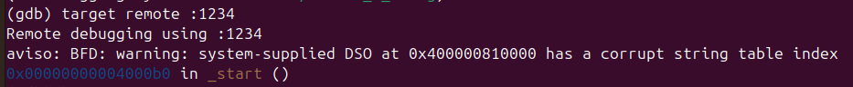
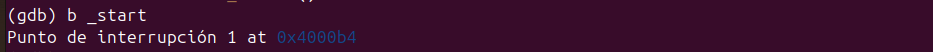
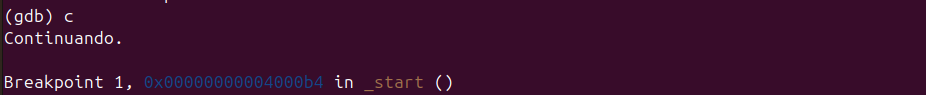
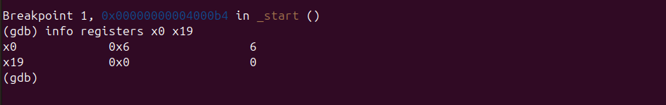
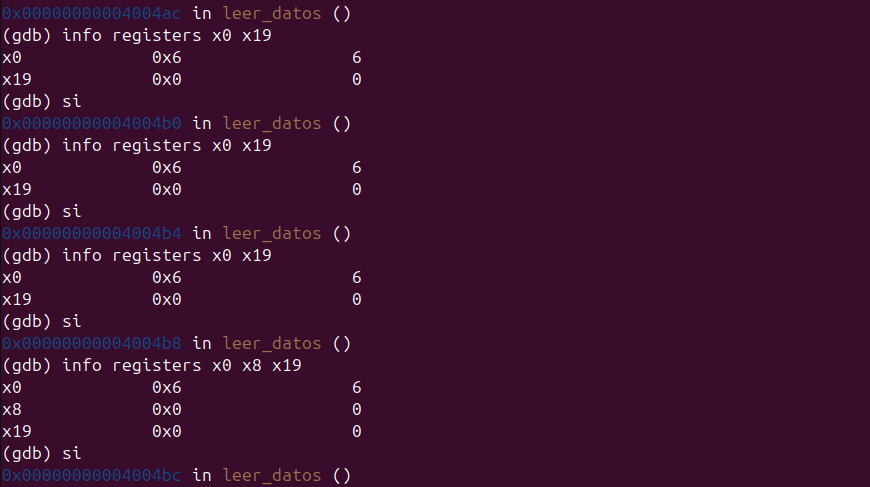
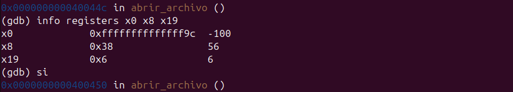
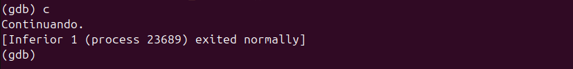
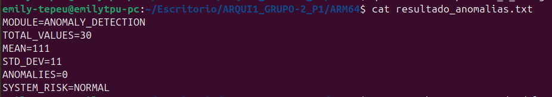

# Módulo 3 - Detección Estadística de Anomalías

## Información General

- **Proyecto:** Invernadero Inteligente IoT
- **Curso:** Arquitectura y Organización de Computadoras y Ensambladores 1
- **Archivo fuente:** modulo_3_anomalias.s
- **Responsable:** Emily Maritza Tepeu Guacamaya
- **Variable analizada:** Gas (GAS)
- **Cantidad de datos procesados:** 30 registros

---

# 1. Descripción del módulo

Este módulo implementa una rutina en lenguaje ensamblador ARM64 encargada de detectar anomalías estadísticas dentro de un conjunto de 30 lecturas del sensor de gas obtenidas desde el archivo `lecturas.csv`.

El análisis se realiza utilizando el método de Z-Score, el cual permite determinar qué valores se alejan significativamente del comportamiento normal de los datos.

El resultado final se almacena en el archivo:

```text
resultado_anomalias.txt
```

---

# 2. Objetivo

Detectar valores anómalos dentro de las lecturas del sensor de gas del invernadero mediante el cálculo de:

* Media aritmética.
* Desviación estándar.
* Z-Score.
* Cantidad total de anomalías.
* Nivel de riesgo del sistema.

---

# 3. Algoritmo Implementado

El algoritmo sigue las siguientes etapas:

## Paso 1: Lectura de datos

Se llama a la rutina:

```asm
leer_datos
```

ubicada en `utils.s`.

Esta función:

* Abre el archivo `lecturas.csv`
* Extrae la columna GAS
* Convierte los valores ASCII a enteros
* Almacena los 30 datos en memoria

---

## Paso 2: Cálculo de la media

Se ejecuta:

```asm
subr_calcular_media
```

Fórmula:

```text
MEDIA = ΣX / N
```

Donde:

* X = valor del sensor de gas
* N = 30

Proceso:

1. Recorrer los 30 datos
2. Acumular la suma total
3. Dividir entre 30
4. Guardar el resultado en `res_mean`

---

## Paso 3: Cálculo de desviación estándar

Se ejecuta:

```asm
subr_calcular_desviacion
```

Fórmulas:

```text
VAR = Σ(X - MEDIA)² / N
DESV = √VAR
```

Proceso:

1. Obtener la media
2. Calcular diferencias respecto a la media
3. Elevar cada diferencia al cuadrado
4. Acumular los resultados
5. Dividir entre N
6. Obtener raíz cuadrada mediante Newton-Raphson

---

## Paso 4: Detección de anomalías

Se ejecuta:

```asm
subr_contar_anomalias
```

Fórmula:

```text
Z = (X - MEDIA) / DESVIACION_ESTANDAR
```

Regla:

```text
|Z| >= 2
```

Para evitar operaciones con decimales se utiliza:

```text
|X - MEDIA| * 10 / DESV
```

y se compara contra:

```text
20
```

equivalente a:

```text
2.0
```

Si el resultado es mayor o igual a 20:

```text
ANOMALIA = TRUE
```

---

## Paso 5: Clasificación de riesgo

Según la cantidad de anomalías encontradas:

| Anomalías | Riesgo |
| --------- | ------ |
| 0         | NORMAL |
| 1 - 3     | MEDIUM |
| 4 o más   | HIGH   |

---

## Paso 6: Generación de resultados

La rutina:

```asm
subr_escribir_resultado
```

crea el archivo:

```text
resultado_anomalias.txt
```

con el formato solicitado por el proyecto.

---

# 4. Flujo del Programa

```text
lecturas.csv
       │
       ▼
leer_datos()
       │
       ▼
subr_calcular_media()
       │
       ▼
subr_calcular_desviacion()
       │
       ▼
subr_contar_anomalias()
       │
       ▼
subr_escribir_resultado()
       │
       ▼
resultado_anomalias.txt
```

---

# 5. Uso de Memoria

## Sección .data

Contiene cadenas de texto utilizadas para generar el archivo de salida.

Ejemplos:

```asm
archivo_salida
str_module
str_mean_label
str_std_label
str_anom_label
str_risk_label
```

Estas variables almacenan mensajes que posteriormente son escritos en el archivo de resultados.

---

## Sección .bss

Espacio reservado para datos calculados durante la ejecución.

| Variable      | Tamaño   | Descripción                     |
| ------------- | -------- | ------------------------------- |
| buf_conv      | 32 bytes | Conversión de enteros a ASCII   |
| res_mean      | 8 bytes  | Almacena la media               |
| res_std       | 8 bytes  | Almacena la desviación estándar |
| res_anomalias | 8 bytes  | Almacena el total de anomalías  |

---

# 6. Registros Utilizados

## Registros principales

| Registro | Uso                                 |
| -------- | ----------------------------------- |
| x0       | Parámetros y valores de retorno     |
| x1       | Longitud de buffers                 |
| x2       | Parámetros para syscalls            |
| x3       | Permisos de archivos                |
| x8       | Número de syscall                   |
| x9       | Direcciones temporales              |
| x10      | Manipulación de buffers             |
| x11      | Divisor decimal                     |
| x12      | Conversión ASCII                    |
| x19      | Dirección base del arreglo de datos |
| x20      | Contador de iteraciones             |
| x21      | Media o acumuladores                |
| x22      | Desviación estándar o acumulador    |
| x23      | Valor actual del arreglo            |
| x24      | Diferencia respecto a la media      |
| x25      | Contador de anomalías               |
| x29      | Frame Pointer                       |
| x30      | Link Register                       |

---

# 7. Ciclos Utilizados

## Ciclo de cálculo de media

Etiqueta:

```asm
calc_mean_loop
```

Recorre los 30 datos y acumula su suma total.

---

## Ciclo de cálculo de varianza

Etiqueta:

```asm
calc_var_loop
```

Calcula la diferencia de cada dato respecto a la media y acumula los cuadrados de dichas diferencias.

---

## Ciclo de Newton-Raphson

Etiqueta:

```asm
sqrt_loop
```

Permite aproximar la raíz cuadrada entera de la varianza para obtener la desviación estándar.

---

## Ciclo de detección de anomalías

Etiqueta:

```asm
anom_loop
```

Recorre todos los datos verificando si cumplen la condición de anomalía.

---

## Ciclo de conversión entero a ASCII

Etiqueta:

```asm
sein_loop
```

Convierte números enteros a caracteres ASCII para escribirlos en el archivo de salida.

---

# 8. Saltos Condicionales Utilizados

| Instrucción | Función                   |
| ----------- | ------------------------- |
| b           | Salto incondicional       |
| bge         | Mayor o igual             |
| blt         | Menor                     |
| beq         | Igual                     |
| cbz         | Comparar contra cero      |
| cbnz        | Comparar distinto de cero |

Los saltos son utilizados para:

* Controlar ciclos
* Validar condiciones
* Detectar errores
* Clasificar anomalías
* Determinar el nivel de riesgo
* Finalizar procesos

---

# 9. Subrutinas Implementadas

## subr_calcular_media

Calcula la media aritmética de los 30 datos.

---

## subr_calcular_desviacion

Calcula la varianza y posteriormente la desviación estándar.

---

## subr_raiz_cuadrada

Implementa el método de Newton-Raphson para obtener la raíz cuadrada entera de la varianza.

---

## subr_contar_anomalias

Determina cuántos valores cumplen la condición:

```text
|Z| >= 2
```

---

## subr_escribir_resultado

Genera el archivo final de resultados.

---

## subr_escribir_buf

Escribe cadenas de texto dentro del archivo de salida.

---

## subr_escribir_entero_nl

Convierte enteros a ASCII y agrega un salto de línea al final.

---

# 10. Formato de Entrada

Archivo utilizado:

```text
lecturas.csv
```

Ejemplo:

```csv
ID,TEMP,HUM_AIRE,HUM_SUELO_1,HUM_SUELO_2,LUZ,GAS,RIEGO_1,RIEGO_2
1,28,70,45,48,320,120,0,0
2,29,68,42,47,300,130,0,0
3,31,65,38,43,250,145,1,0
...
30,30,66,41,44,260,150,0,0
```

El módulo procesa únicamente los valores del sensor de gas almacenados en la columna GAS del archivo `lecturas.csv`.

---

# 11. Formato de Salida

Archivo generado:

```text
resultado_anomalias.txt
```

Ejemplo:

```text
MODULE=ANOMALY_DETECTION
TOTAL_VALUES=30
MEAN=29
STD_DEV=3
ANOMALIES=4
SYSTEM_RISK=HIGH
```

Descripción de cada campo:

| Campo        | Descripción                      |
| ------------ | -------------------------------- |
| MODULE       | Nombre del módulo ejecutado      |
| TOTAL_VALUES | Cantidad de datos procesados     |
| MEAN         | Media calculada                  |
| STD_DEV      | Desviación estándar              |
| ANOMALIES    | Cantidad de anomalías detectadas |
| SYSTEM_RISK  | Nivel de riesgo obtenido         |

---

# 12. Evidencia de Depuración con GDB

## Captura 1 — Conexión remota

Se conecta GDB al programa mediante `target remote :1234`. GDB se conecta correctamente al programa en ejecución bajo QEMU y muestra la dirección donde se encuentra `_start`, punto de entrada del programa.



## Captura 2 — Breakpoint en _start

Se establece un breakpoint en `_start`, punto de entrada del programa. GDB asigna el breakpoint en la dirección 0x4000b4.



## Captura 3 — Programa detenido en _start

El programa se detiene en el breakpoint de `_start`. GDB confirma que estamos en la dirección 0x4000b4, inicio del módulo 3.



## Captura 4 — Registros iniciales

Estado inicial de los registros. `x0=6` indica que el módulo leerá la columna 6 (GAS) del CSV. `x19=0` porque aún no se ha guardado ningún valor.



## Captura 5 — Entrada a leer_datos y preservación de columna

El programa avanza instrucción por instrucción con `si`. Se observa que `x0=6` se conserva como parámetro de la columna GAS. Al entrar a `leer_datos`, el valor se guarda en `x19=6`, preservándolo para usarlo durante toda la ejecución.



## Captura 6 — Syscall openat y AT_FDCWD

Se observa que `x8=56` es el numero de la syscall `openat` para abrir el archivo `lecturas.csv`. `x0=-100` es el valor de `AT_FDCWD` que le indica al sistema operativo que busque el archivo en el directorio actual. `x19=6` confirma que el numero de columna GAS fue preservado correctamente durante todo el proceso.



## Captura 7 — Programa terminado exitosamente

El programa continua su ejecución, procesa los 30 datos de gas, calcula la media, desviación estándar y detecta anomalías. Finaliza con código de éxito.



## Captura 8 — Resultados del módulo

El programa terminó exitosamente. Se verifica el archivo de salida `resultado_anomalias.txt`. `MEAN=111` es el promedio de gas en ppm, `STD_DEV=11` es la desviación estándar, `ANOMALIES=0` indica que no se detectaron valores anómalos y `SYSTEM_RISK=NORMAL`.



